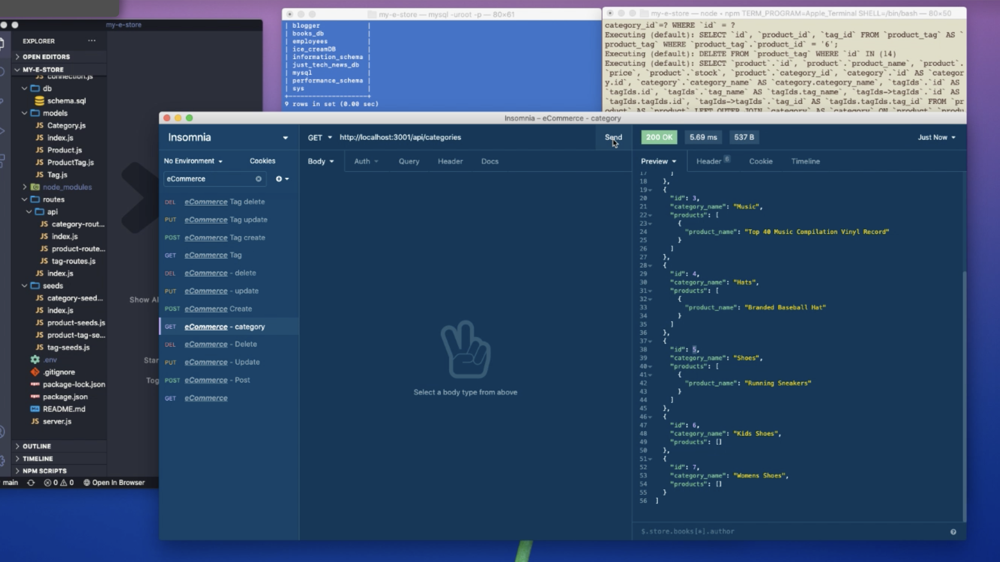

# My E Store - Backend

## Description
My E Store is a REST API that populates an ecommerce database. A user can create, read, update and delete products, categories and tags.

***
## Table of Contents
[Installation](#installation) 
[Usage](#usage) 
[Contributing](#contributing) 
[Tests](#tests) 
[License](#license) 
[Questions](#questions) 
***
## Installation
Install npm and run npm start to run the program in the command line.

## Usage
This API can be used to populate a database for an online store.

* WalkThrough Video Part One: 
https://drive.google.com/file/d/1V9_npNK5DDxUpsS2qLqEsev_9NEutX4A/view

* WalkThrough Video Part Two:
https://drive.google.com/file/d/1HDltdY8FjbnSM6cYjBYCuQn_SSSYcIsf/view

## Contributing

## Tests

## License
### This license is covered under the  license(s):
* 
***
## Questions
For more information contact me at: 
* Name: aksmith5239
* GitHub: https://github.com/aksmith5239/my-e-store
* Email Address: aklobby@gmail.com
    